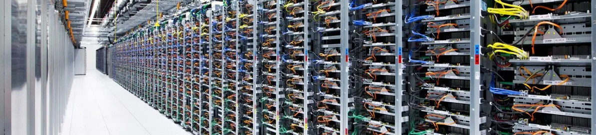
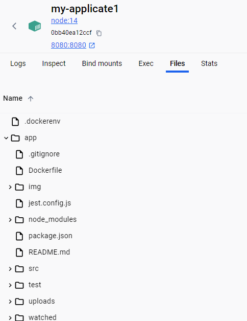
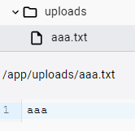
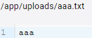
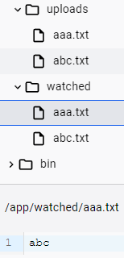
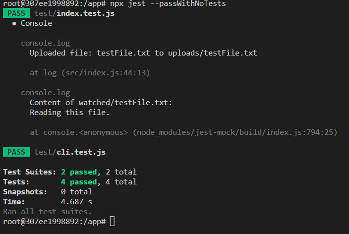

# Asset Catalog

This assignment will simulate the various tasks around storing *assets* in a distributed system.
For all intents and purposes, the *assets* mentioned above could be of any type: audio, images, videos, text-data, binary-data, etc.
The goal of the assignment is to upload *assets* from any number of *remote clients* to a *centralized server* for persistent storage. The server is responsible for the storage of the actual data that represents the *asset*, as well as the metadata that describes the data.



1. The client will run as a CLI tool on a remote machine, *(more than 1 client can be active at any given time).

   Using the CLI, you can access the directory/folder externally: read from it, add files to it and change a file, upload another file instead! All via the command line!!!

2. The client will watch a directory for file changes and upload the changed files to the remote server.

   Watching a directory = cache, which contains a record of the file name, for all files uploaded to the server.
   Can be as a json file that stores a file name. The emphasis is that it is local to the computer.

3. The client will not change or move the files from the watched directory at any point.

   Do not allow changes to be made or move files from the watched directory, but only upload files from it.

4. No file can be uploaded twice (even when multiple clients are running).

   The file upload will be performed as a "critical section" and will contain a code section that will not allow 2 clients to enter the critical section at the same time using a lock.
   The critical section includes the code of the updated file retrieval process, meaning that after deciding which file to upload, it checks if the process is already locked by a certain condition, if not, it enters the critical section code and locks after it, updates a file and exits the critical section and releases the lock.
   Reading/viewing is possible for 2 clients at the same time, but only file uploads are performed as a critical section.

5. The client must be able to recover state from a previous execution.

   Since file names are stored locally
   The term "recovering state" from a previous execution does not exist!!
   This is not a process that stops or ends and then the data is lost, but a local cache that is saved.

## Running the project

```bash
docker run -it --entrypoint bash --name  my-applicate -v ${PWD}:/app -p 8080:8080  node:14
```


```bash
cd app
```

For the first time he creates the files:

```bash
node src/cli.js start
```

output:

```bash
Directory ./watched created.
Directory ./uploads created.
Started watching the directory...
```



In the terminal that opens, you can write the following commands,

To upload a file:

```bash
node src/cli.js upload src/aaa.txt
```

output:

```bash
File src/aaa.txt uploaded.
```



To read a file:

```bash
node src/cli.js read-file uploads/aaa.txt
```

output:

```bash
Content of uploads/aaa.txt:
aaa
```



To update a file:

```bash
node src/cli.js update-file aaa.txt "abc"
```

```bash
File aaa.txt updated with new content.
```



---

Run tests:

```bash
 npx jest --passWithNoTests
```


